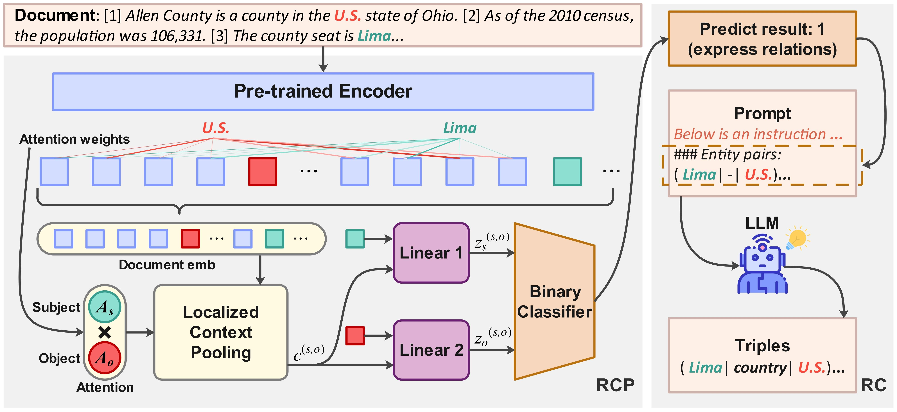

# LLM with Relation Classifier for Document-Level Relation Extraction

<div align="center">

[](https://arxiv.org/abs/2408.13889) [](https://huggingface.co/datasets/zuopingyi/LMRC_data/)

</div>



Code for paper [LLM with Relation Classifier for Document-Level Relation Extraction](https://www.arxiv.org/abs/2408.13889#)

## Abstract

Large language models (LLMs) have created a new paradigm for natural language processing. Despite their advancement, LLM-based methods still lag behind traditional approaches in document-level relation extraction (DocRE), a critical task for understanding complex entity relations within long context. This paper investigates the causes of this performance gap, identifying the dispersion of attention by LLMs due to entity pairs without relations as a key factor. We then introduce a novel classifier-LLM approach to DocRE. Particularly, the proposed approach begins with a classifier designed to select entity pair candidates that exhibit potential relations and then feed them to LLM for final relation classification. This method ensures that the LLM's attention is directed at relation-expressing entity pairs instead of those without relations during inference. Experiments on DocRE benchmarks reveal that our method significantly outperforms recent LLM-based DocRE models and narrows the performance gap with state-of-the-art BERT-based models.

## Set up

Since the environments for **Relation Candidate Proposal (RCP)** and **Relation Classification (RC)** differ significantly, we recommend setting them up separately.

### 1. Environment for RCP

Please refer to the `RCP` folder for the specific requirements. You can set up the environment by running:

```shell
# Create a new environment
conda create -n rcp python=3.9
conda activate rcp

# Install dependencies
cd RCP
pip install -r requirements.txt
```

### 2. Environment for RC

The RC stage relies on **LLaMA-Factory**. Please enter the `RC` directory, clone the repository, and install the environment as follows:

```shell
# Create a new environment
conda create -n rc python=3.10
conda activate rc

# Install dependencies
cd RC
git clone https://github.com/hiyouga/LLaMA-Factory.git
cd LLaMA-Factory
pip install -e .[metrics]
```

## Data

All datasets and fine-tuning data required for this project are provided in the `data` directory. Please refer to the `data` folder for detailed information regarding the file structure and contents.

## Run Experiments

The experiment pipeline consists of three main stages: RCP, RC, and Evaluation.

### 1. Relation Candidate Proposal (RCP)

Navigate to the RCP directory and run the Roberta model:

```shell
cd RCP
bash run_roberta.sh
```

**Note:** The training and inference modes share the same script. You can switch modes by modifying the `--load_path` argument in `run_roberta.sh`.

After obtaining the model predictions, convert the results into the format required for the next step (step 2):

```shell
python generate_for_step2.py
```

This script generates a JSON output containing the data and attaches the corresponding `title` to each entry to facilitate subsequent evaluation.

### 2. Relation Classification (RC)

#### Fine-tuning

First, fine-tune your model using the data provided in the `data` folder (alternatively, you can use `construct_prompt.py` to construct the data yourself).

We use **LLaMA-Factory** for fine-tuning. Follow these steps:

1.  **Prepare Data:** Copy your fine-tuning data to the `LLaMA-Factory/data` folder.
2.  **Register Data:** Add your dataset definition to `LLaMA-Factory/data/dataset_info.json`.
3.  **Configure:** Create a `config.yaml` based on the template found in `LLaMA-Factory/examples/train_lora/llama3_lora_sft.yaml`.
4.  **Run Training:**

```shell
cd LLaMA-Factory
llamafactory-cli train examples/train_lora/your_config.yaml
```

#### Inference

Once fine-tuning is complete, configure the inference settings by modifying `infer/config.yaml`. Then, run the inference script:

```shell
cd RC
bash infer.sh
```

### 3. Evaluation

Finally, map the plain text output from the LLM to a structured format suitable for evaluation, and then run the evaluation script.

```shell
# Convert LLM text output to structured format
python map_results.py

# Evaluate the results
python evaluation.py
```

## Citation

If you find this work useful, please cite:

```bibtex
@article{li2024llm,
  title={Llm with relation classifier for document-level relation extraction},
  author={Li, Xingzuo and Chen, Kehai and Long, Yunfei and Zhang, Min},
  journal={arXiv preprint arXiv:2408.13889},
  year={2024}
}
```